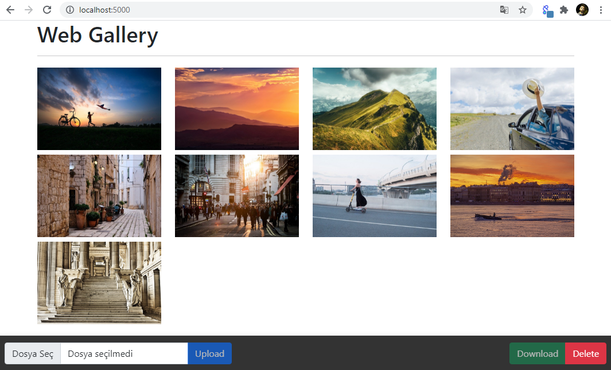

# WebGallery
A simple web application with image upload feature

<ul>
    <li>
        <code>npm i</code>
    </li>
    <li>
        <code>npm i --save-dev nodemon</code>
    </li>
</ul>
    Proje dizinide ".env" dosyasını oluşturduktan osnra içeriğine şunları ekleyin:

    PORT:5000
    DATABASE_URL: <mongodb atlas url>

        
<ul>
    <li>
        <code>npm start</code>
    </li>
</ul>

